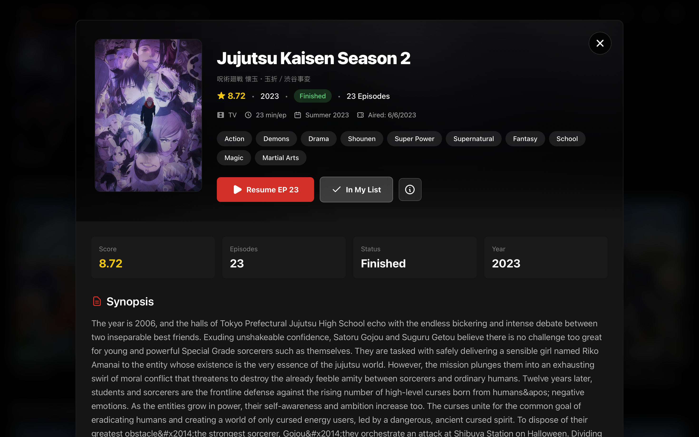
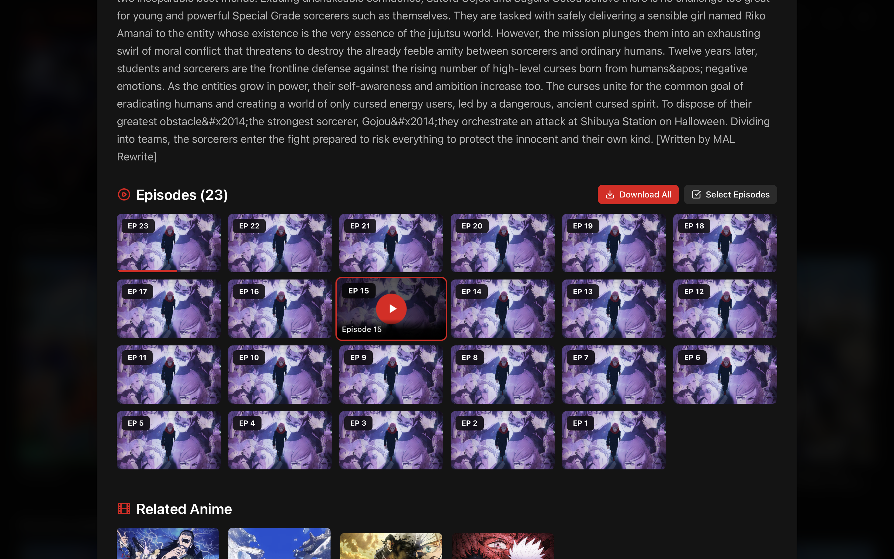
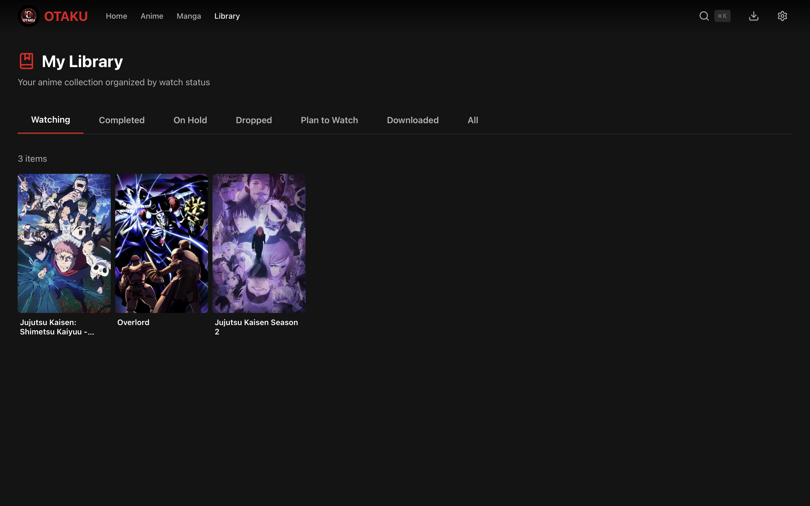
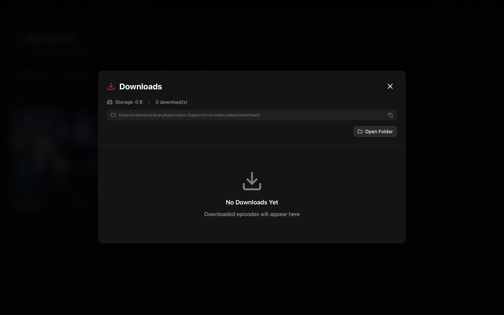
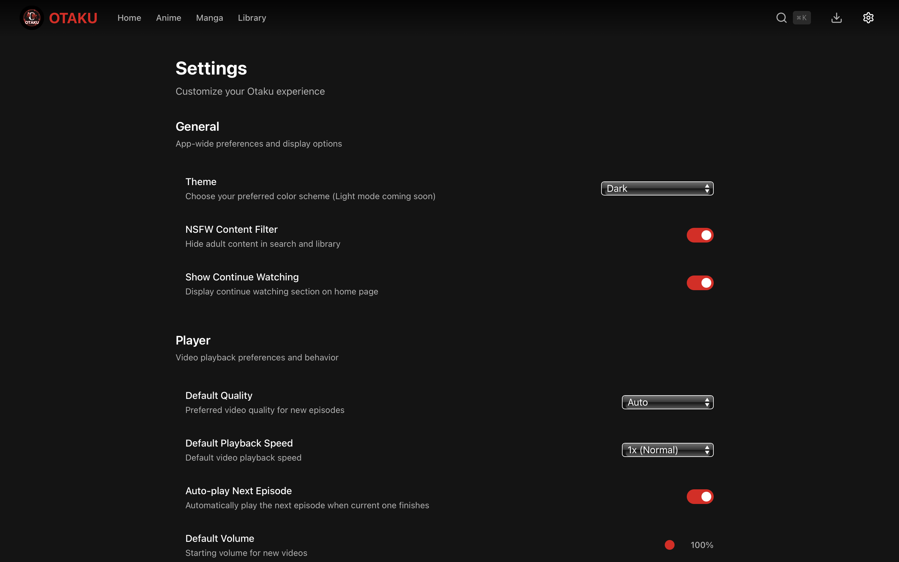

# Otaku

A cross-platform desktop application for streaming and managing anime, built with Tauri, React, and Rust. Otaku provides a modern, Netflix-inspired interface for discovering, watching, and organizing your anime collection.

---

## Table of Contents

- [Features](#features)
- [Screenshots](#screenshots)
- [System Requirements](#system-requirements)
- [Installation](#installation)
  - [Download Pre-built Binaries](#download-pre-built-binaries)
  - [Windows Installation](#windows-installation)
  - [macOS Installation](#macos-installation)
  - [Linux Installation](#linux-installation)
- [Building from Source](#building-from-source)
- [Usage Guide](#usage-guide)
- [Keyboard Shortcuts](#keyboard-shortcuts)
- [Configuration](#configuration)
- [Extension System](#extension-system)
- [Troubleshooting](#troubleshooting)
- [Contributing](#contributing)
- [Tech Stack](#tech-stack)
- [Project Structure](#project-structure)
- [License](#license)
- [Disclaimer](#disclaimer)

---

## Features

### Streaming and Playback

- Stream anime from multiple sources with adaptive bitrate streaming
- Full HLS (HTTP Live Streaming) support with automatic quality adjustment
- Manual quality selection supporting 1080p, 720p, 480p, and 360p resolutions
- Multiple server options for each episode with easy switching
- Seamless episode navigation with next/previous controls
- Automatic progress saving with resume functionality
- Native fullscreen support with smooth transitions

### Library Management

- Personal anime library with categorization support
- Status tracking: Watching, Completed, Plan to Watch, On Hold, Dropped
- Favorites system for quick access to preferred titles
- Watch history tracking across all episodes
- Continue watching section for easy access to in-progress anime

### Discovery and Search

- Real-time search with instant results as you type
- Dynamic genre filtering with anime count indicators
- Browse over 100 genres and tags fetched from source
- Multi-genre filtering support for refined searches
- Trending and recommended anime sections
- Related anime suggestions on detail pages

### Download Manager

- Download episodes for offline viewing
- Batch download support for entire series or selected episodes
- Real-time download progress tracking
- Pause, resume, and cancel functionality
- Automatic file organization by series
- Downloaded content available without internet connection

### User Interface

- Dark theme optimized for extended viewing sessions
- Responsive design adapting to various window sizes
- Three grid density options: Compact, Comfortable, Spacious
- Modal-based detail views without navigation interruption
- Smooth animations and transitions throughout
- Keyboard-first navigation support

### Technical Highlights

- Cross-platform support for Windows, macOS, and Linux
- Native performance with Rust backend
- Low memory footprint compared to Electron alternatives
- SQLite database for local data persistence
- Modular extension system for content sources
- Secure sandboxed JavaScript execution for extensions

---

## Screenshots

### Home Screen


*The main home screen displaying the continue watching section, trending anime, and personalized recommendations based on viewing history.*

### Anime Browser


*The anime browser page with search functionality and genre-based filtering. Users can discover new anime through various categories and real-time search.*

### Genre Filtering


*Dynamic genre filtering interface showing available genres with anime counts. Multiple genres can be selected to narrow down results.*

### Anime Details Modal



*Detailed anime information modal showing synopsis, metadata, episode list, and related anime. Users can add to library, start watching, or download episodes from this view.*

### Episode Grid



*Episode selection grid with visual indicators for watched, partially watched, and downloaded episodes. Hover states reveal quick actions.*

### Video Player


*Full-featured video player with custom controls, quality selection, and server switching. The player supports keyboard shortcuts for efficient navigation.*

### Player Controls Overlay


*Video player controls showing playback controls, progress bar, volume slider, quality selector, server switcher, and episode navigation buttons.*

### Quality and Server Selection


*Dropdown menus for selecting video quality and streaming server. Available options vary based on the source.*

### Library View



*Personal library organized by status categories. Users can filter by Watching, Completed, Plan to Watch, On Hold, or Dropped.*

### Download Manager



*Download manager interface showing active downloads with progress bars, completed downloads, and storage usage information.*

### Settings Page



*Application settings including appearance options, playback preferences, storage management, and developer tools.*

### Continue Watching Section


*Continue watching carousel showing recently watched anime with progress indicators and quick resume functionality.*

### Search Results


*Real-time search results displaying matching anime with cover images, titles, and basic metadata.*

---

## System Requirements

### Minimum Requirements

| Component | Windows | macOS | Linux |
|-----------|---------|-------|-------|
| Operating System | Windows 10 version 1803 or later | macOS 10.15 Catalina or later | Ubuntu 20.04, Fedora 33, or equivalent |
| Processor | 64-bit Intel or AMD processor | Intel or Apple Silicon | 64-bit Intel, AMD, or ARM processor |
| Memory | 4 GB RAM | 4 GB RAM | 4 GB RAM |
| Storage | 200 MB for application | 200 MB for application | 200 MB for application |
| Display | 1280 x 720 minimum resolution | 1280 x 720 minimum resolution | 1280 x 720 minimum resolution |
| Network | Broadband internet connection | Broadband internet connection | Broadband internet connection |

### Recommended Requirements

| Component | Specification |
|-----------|---------------|
| Memory | 8 GB RAM or more |
| Storage | SSD with 20 GB or more free space for downloads |
| Display | 1920 x 1080 or higher resolution |
| Network | 25 Mbps or faster for HD streaming |

### Platform-Specific Requirements

**Windows:**
- Microsoft Edge WebView2 Runtime (automatically installed if not present)
- Visual C++ Redistributable (included with installer)

**macOS:**
- No additional runtime dependencies required
- Rosetta 2 for Apple Silicon when running Intel builds (automatic)

**Linux:**
- WebKitGTK 4.1
- libappindicator3 or libayatana-appindicator3
- GStreamer with appropriate codecs for media playback

---

## Installation

### Download Pre-built Binaries

Pre-built installers and packages are available for all supported platforms on the GitHub Releases page.

**Latest Release:** [https://github.com/vishnukv64/otaku/releases/latest](https://github.com/vishnukv64/otaku/releases/latest)

**All Releases:** [https://github.com/vishnukv64/otaku/releases](https://github.com/vishnukv64/otaku/releases)

### Available Downloads

| Platform | Architecture | Filename | Description |
|----------|--------------|----------|-------------|
| Windows | x64 (Intel/AMD) | `otaku_VERSION_x64-setup.exe` | NSIS installer with automatic WebView2 installation |
| Windows | x64 (Intel/AMD) | `otaku_VERSION_x64_en-US.msi` | MSI package for enterprise deployment |
| macOS | ARM64 (Apple Silicon) | `otaku_VERSION_aarch64.dmg` | Disk image for M1, M2, M3 Macs |
| macOS | x64 (Intel) | `otaku_VERSION_x64.dmg` | Disk image for Intel-based Macs |
| Linux | x64 (Intel/AMD) | `otaku_VERSION_amd64.deb` | Debian package for Ubuntu, Debian, and derivatives |
| Linux | x64 (Intel/AMD) | `otaku_VERSION_amd64.rpm` | RPM package for Fedora, RHEL, and derivatives |
| Linux | x64 (Intel/AMD) | `otaku_VERSION_amd64.AppImage` | Portable AppImage requiring no installation |
| Linux | ARM64 | `otaku_VERSION_arm64.deb` | Debian package for ARM64 systems |
| Linux | ARM64 | `otaku_VERSION_arm64.AppImage` | Portable AppImage for ARM64 systems |

Replace `VERSION` with the actual version number (e.g., `0.1.0`).

---

### Windows Installation

#### Method 1: NSIS Installer (Recommended)

The NSIS installer provides the simplest installation experience with automatic dependency handling.

1. Download `otaku_VERSION_x64-setup.exe` from the releases page
2. Run the downloaded installer
3. If prompted by Windows SmartScreen, click "More info" then "Run anyway"
4. Follow the installation wizard:
   - Accept the license agreement
   - Choose installation directory (default: `C:\Program Files\Otaku`)
   - Select whether to create desktop and Start Menu shortcuts
5. Click "Install" and wait for completion
6. Launch Otaku from the Start Menu or desktop shortcut

The installer will automatically download and install Microsoft Edge WebView2 Runtime if not already present on your system.

#### Method 2: MSI Package

The MSI package is suitable for enterprise deployment and silent installations.

**Interactive Installation:**
1. Download `otaku_VERSION_x64_en-US.msi` from the releases page
2. Double-click the MSI file to start the installer
3. Follow the installation wizard prompts

**Silent Installation (Command Line):**
```powershell
# Basic silent installation
msiexec /i otaku_VERSION_x64_en-US.msi /quiet

# Silent installation with logging
msiexec /i otaku_VERSION_x64_en-US.msi /quiet /log install.log

# Installation to custom directory
msiexec /i otaku_VERSION_x64_en-US.msi INSTALLDIR="D:\Apps\Otaku" /quiet
```

#### Updating on Windows

To update to a newer version:
1. Download the new installer from the releases page
2. Run the installer - it will automatically replace the previous version
3. Your settings and library data will be preserved

#### Uninstalling from Windows

**Method 1: Settings App**
1. Open Windows Settings (Win + I)
2. Navigate to Apps > Installed apps
3. Search for "Otaku"
4. Click the three-dot menu and select "Uninstall"

**Method 2: Control Panel**
1. Open Control Panel
2. Navigate to Programs > Programs and Features
3. Select "Otaku" from the list
4. Click "Uninstall"

**Method 3: Command Line**
```powershell
# For MSI installations
msiexec /x otaku_VERSION_x64_en-US.msi /quiet
```

---

### macOS Installation

#### Determining Your Mac's Architecture

Before downloading, determine whether your Mac uses Apple Silicon or Intel:
1. Click the Apple menu in the top-left corner
2. Select "About This Mac"
3. Look for the "Chip" or "Processor" information:
   - "Apple M1", "Apple M2", or "Apple M3" indicates Apple Silicon (ARM64)
   - "Intel Core" indicates an Intel processor (x64)

#### Method 1: DMG Installation (Recommended)

1. Download the appropriate DMG file:
   - Apple Silicon Macs: `otaku_VERSION_aarch64.dmg`
   - Intel Macs: `otaku_VERSION_x64.dmg`
2. Double-click the downloaded DMG file to mount it
3. In the opened window, drag the Otaku icon to the Applications folder
4. Eject the DMG by right-clicking it in Finder and selecting "Eject"
5. Open Otaku from the Applications folder or Spotlight (Cmd + Space, type "Otaku")

#### Handling macOS Security Warnings

On first launch, macOS may display a security warning because the application is not signed with an Apple Developer certificate.

**If you see "Otaku cannot be opened because it is from an unidentified developer":**

1. Open System Preferences (or System Settings on macOS Ventura and later)
2. Navigate to Security & Privacy (or Privacy & Security)
3. In the General tab, you should see a message about Otaku being blocked
4. Click "Open Anyway"
5. In the confirmation dialog, click "Open"

**Alternative method using right-click:**
1. Locate Otaku in the Applications folder
2. Right-click (or Control-click) the application
3. Select "Open" from the context menu
4. Click "Open" in the confirmation dialog

After the first launch, macOS will remember your choice and allow the application to open normally.

#### Method 2: Homebrew (Coming Soon)

Support for Homebrew installation is planned for future releases:
```bash
brew install --cask otaku
```

#### Updating on macOS

To update to a newer version:
1. Download the new DMG from the releases page
2. Mount the DMG and drag the new Otaku app to Applications
3. When prompted to replace the existing application, click "Replace"
4. Your settings and library data will be preserved

#### Uninstalling from macOS

**Basic Uninstallation:**
1. Open Finder and navigate to the Applications folder
2. Drag Otaku to the Trash
3. Empty the Trash

**Complete Uninstallation (including preferences and data):**
```bash
# Remove the application
rm -rf /Applications/Otaku.app

# Remove application support data
rm -rf ~/Library/Application\ Support/com.otaku.player

# Remove preferences
rm -rf ~/Library/Preferences/com.otaku.player.plist

# Remove cache
rm -rf ~/Library/Caches/com.otaku.player

# Remove logs
rm -rf ~/Library/Logs/com.otaku.player
```

---

### Linux Installation

#### Method 1: Debian Package (Ubuntu, Debian, Linux Mint, Pop!_OS)

**Using dpkg:**
```bash
# Download the package (replace VERSION with actual version)
wget https://github.com/vishnukv64/otaku/releases/download/vVERSION/otaku_VERSION_amd64.deb

# Install the package
sudo dpkg -i otaku_VERSION_amd64.deb

# If there are missing dependencies, fix them with:
sudo apt-get install -f
```

**Using apt (if you have the .deb file locally):**
```bash
sudo apt install ./otaku_VERSION_amd64.deb
```

**Using gdebi (handles dependencies automatically):**
```bash
# Install gdebi if not present
sudo apt install gdebi-core

# Install Otaku
sudo gdebi otaku_VERSION_amd64.deb
```

#### Method 2: RPM Package (Fedora, RHEL, CentOS, openSUSE)

**Using dnf (Fedora):**
```bash
# Download and install
sudo dnf install https://github.com/vishnukv64/otaku/releases/download/vVERSION/otaku_VERSION_amd64.rpm

# Or if you have the file locally:
sudo dnf install ./otaku_VERSION_amd64.rpm
```

**Using rpm:**
```bash
# Download the package
wget https://github.com/vishnukv64/otaku/releases/download/vVERSION/otaku_VERSION_amd64.rpm

# Install
sudo rpm -i otaku_VERSION_amd64.rpm
```

**Using zypper (openSUSE):**
```bash
sudo zypper install ./otaku_VERSION_amd64.rpm
```

#### Method 3: AppImage (Universal, No Installation Required)

AppImage provides a portable way to run Otaku without installation. It works on most Linux distributions.

```bash
# Download the AppImage
wget https://github.com/vishnukv64/otaku/releases/download/vVERSION/otaku_VERSION_amd64.AppImage

# Make it executable
chmod +x otaku_VERSION_amd64.AppImage

# Run the application
./otaku_VERSION_amd64.AppImage
```

**Optional: Integrate AppImage with your system:**
```bash
# Move to a standard location
mkdir -p ~/.local/bin
mv otaku_VERSION_amd64.AppImage ~/.local/bin/otaku

# Ensure ~/.local/bin is in your PATH
# Add to ~/.bashrc or ~/.zshrc if not already present:
export PATH="$HOME/.local/bin:$PATH"

# Now you can run it from anywhere:
otaku
```

**Using AppImageLauncher (recommended for desktop integration):**

AppImageLauncher automatically integrates AppImages with your desktop environment:
```bash
# Install AppImageLauncher (Ubuntu/Debian)
sudo apt install appimagelauncher

# Then simply double-click the AppImage file
# AppImageLauncher will offer to integrate it
```

#### Method 4: Arch Linux (AUR)

For Arch Linux and derivatives (Manjaro, EndeavourOS):

```bash
# Using yay
yay -S otaku-bin

# Using paru
paru -S otaku-bin

# Manual installation from AUR
git clone https://aur.archlinux.org/otaku-bin.git
cd otaku-bin
makepkg -si
```

#### Installing Dependencies

If the application fails to start, ensure all required dependencies are installed:

**Ubuntu/Debian:**
```bash
sudo apt update
sudo apt install libwebkit2gtk-4.1-0 libappindicator3-1 gstreamer1.0-plugins-base gstreamer1.0-plugins-good
```

**Fedora:**
```bash
sudo dnf install webkit2gtk4.1 libappindicator-gtk3 gstreamer1-plugins-base gstreamer1-plugins-good
```

**Arch Linux:**
```bash
sudo pacman -S webkit2gtk-4.1 libappindicator-gtk3 gst-plugins-base gst-plugins-good
```

**openSUSE:**
```bash
sudo zypper install webkit2gtk3-soup2-devel libappindicator3-1
```

#### Updating on Linux

**Debian/Ubuntu:**
```bash
sudo dpkg -i otaku_NEWVERSION_amd64.deb
```

**Fedora/RHEL:**
```bash
sudo dnf upgrade ./otaku_NEWVERSION_amd64.rpm
```

**AppImage:**
Simply download the new AppImage and replace the old one.

#### Uninstalling from Linux

**Debian/Ubuntu:**
```bash
sudo apt remove otaku
# Or to remove with configuration files:
sudo apt purge otaku
```

**Fedora/RHEL:**
```bash
sudo dnf remove otaku
```

**Arch Linux:**
```bash
sudo pacman -R otaku-bin
```

**AppImage:**
```bash
rm ~/.local/bin/otaku
# Remove desktop integration if applicable
rm ~/.local/share/applications/otaku.desktop
```

**Remove user data (all distributions):**
```bash
rm -rf ~/.config/com.otaku.player
rm -rf ~/.local/share/com.otaku.player
rm -rf ~/.cache/com.otaku.player
```

---

## Building from Source

Building from source allows you to run the latest development version or customize the application.

### Prerequisites

Ensure the following tools are installed on your system:

| Tool | Minimum Version | Purpose |
|------|-----------------|---------|
| Node.js | 18.0 | JavaScript runtime |
| pnpm | 8.0 | Package manager |
| Rust | 1.70 | Backend compilation |
| Git | 2.0 | Source code management |

### Installing Prerequisites

**Node.js:**
- Download from [https://nodejs.org/](https://nodejs.org/) (LTS version recommended)
- Or use a version manager like nvm or fnm

**pnpm:**
```bash
# Using npm
npm install -g pnpm

# Using Homebrew (macOS)
brew install pnpm

# Using standalone script
curl -fsSL https://get.pnpm.io/install.sh | sh -
```

**Rust:**
```bash
# Using rustup (recommended)
curl --proto '=https' --tlsv1.2 -sSf https://sh.rustup.rs | sh

# Follow the prompts and restart your terminal
```

### Platform-Specific Build Dependencies

#### Windows

1. Install Visual Studio Build Tools:
   - Download from [https://visualstudio.microsoft.com/visual-cpp-build-tools/](https://visualstudio.microsoft.com/visual-cpp-build-tools/)
   - Run the installer and select "Desktop development with C++"
   - Ensure "Windows 10 SDK" and "MSVC v143 - VS 2022 C++ x64/x86 build tools" are checked

2. WebView2 Runtime is typically pre-installed on Windows 10/11

#### macOS

Install Xcode Command Line Tools:
```bash
xcode-select --install
```

#### Linux (Ubuntu/Debian)

```bash
sudo apt update
sudo apt install -y \
    build-essential \
    curl \
    wget \
    file \
    libssl-dev \
    libwebkit2gtk-4.1-dev \
    libayatana-appindicator3-dev \
    librsvg2-dev \
    patchelf
```

#### Linux (Fedora)

```bash
sudo dnf groupinstall "Development Tools"
sudo dnf install \
    curl \
    wget \
    file \
    openssl-devel \
    webkit2gtk4.1-devel \
    libappindicator-gtk3-devel \
    librsvg2-devel
```

#### Linux (Arch)

```bash
sudo pacman -S --needed \
    base-devel \
    curl \
    wget \
    file \
    openssl \
    webkit2gtk-4.1 \
    libappindicator-gtk3 \
    librsvg
```

### Building the Application

```bash
# Clone the repository
git clone https://github.com/vishnukv64/otaku.git
cd otaku

# Install JavaScript dependencies
pnpm install

# Run in development mode with hot reload
pnpm tauri dev

# Build for production
pnpm tauri build
```

### Build Output Location

After a successful build, installers and packages are located in:

```
src-tauri/target/release/bundle/
├── deb/                    # Debian packages (.deb)
├── rpm/                    # RPM packages (.rpm)
├── appimage/               # Linux AppImage
├── dmg/                    # macOS disk images (.dmg)
├── macos/                  # macOS application bundle (.app)
├── msi/                    # Windows MSI installer
└── nsis/                   # Windows NSIS installer (.exe)
```

### Cross-Compilation

**Building for Apple Silicon on Intel Mac:**
```bash
rustup target add aarch64-apple-darwin
pnpm tauri build --target aarch64-apple-darwin
```

**Building for Intel on Apple Silicon Mac:**
```bash
rustup target add x86_64-apple-darwin
pnpm tauri build --target x86_64-apple-darwin
```

**Building Universal macOS Binary (both architectures):**
```bash
pnpm tauri build --target universal-apple-darwin
```

### Development Commands Reference

```bash
# Start development server (frontend only)
pnpm dev

# Start Tauri development mode (full application with hot reload)
pnpm tauri dev

# Build frontend only
pnpm build

# Build complete Tauri application
pnpm tauri build

# Build debug version (faster, includes debug symbols)
pnpm tauri build --debug

# Run linting
pnpm lint

# Run linting with auto-fix
pnpm lint:fix

# Check TypeScript types
pnpm typecheck

# Run tests
pnpm test

# Run tests once without watch mode
pnpm test:run

# Run tests with UI
pnpm test:ui

# Format code
pnpm format

# Check code formatting
pnpm format:check
```

---

## Usage Guide

### First Launch

When you launch Otaku for the first time:

1. The application will initialize and create necessary data directories
2. The default anime source extension will be loaded automatically
3. The home screen will display trending and recommended anime

### Browsing Anime

1. Click "Anime" in the navigation bar to access the anime browser
2. Use the search bar at the top to find specific titles
3. Click on genre tags to filter anime by genre
4. Select multiple genres for combined filtering
5. Click "Show More" to reveal additional genre options
6. Clear filters by clicking the "All" button or individual filter removal

### Viewing Anime Details

1. Click on any anime card to open the details modal
2. The modal displays:
   - Cover image and background
   - Title in multiple languages (if available)
   - Rating, year, status, and episode count
   - Genre tags
   - Synopsis/description
   - Episode grid with watched indicators
   - Related anime recommendations
3. From this modal you can:
   - Start watching from episode 1
   - Resume from where you left off
   - Add or remove from your library
   - Download episodes

### Watching Anime

1. Click "Watch Now" or "Resume" to start playback
2. Select a specific episode from the episode grid
3. In the video player:
   - Click the play/pause button or press Space
   - Drag the progress bar to seek
   - Click the quality button to change resolution
   - Click the server button to switch streaming servers
   - Use the volume slider to adjust audio
   - Click fullscreen or press F for fullscreen mode
   - Use N and P keys for next/previous episode

### Managing Your Library

1. Navigate to "Library" in the navigation bar
2. Filter by status using the category tabs:
   - All: Shows entire library
   - Watching: Currently watching
   - Completed: Finished series
   - Plan to Watch: Intended to watch
   - On Hold: Temporarily paused
   - Dropped: Stopped watching
3. Add anime to library from the details modal
4. Change status by right-clicking (or long-pressing on touch) library items

### Downloading Episodes

1. Open the anime details modal
2. Click "Download All" to queue all episodes
3. Or click "Select Episodes" to choose specific episodes:
   - Click individual episodes to select/deselect
   - Use "Select All" for bulk selection
   - Click "Download Selected" when ready
4. Monitor downloads in the Downloads section
5. Downloaded episodes show a green indicator in the episode grid
6. Click on downloaded episodes to play them offline

### Settings and Preferences

Access settings through the gear icon in the navigation bar:

1. **Appearance**
   - Grid Density: Compact, Comfortable, or Spacious

2. **Playback**
   - Preferred Quality: Auto, 1080p, 720p, 480p, 360p
   - Preferred Server: Select default streaming server
   - Auto-play Next Episode: Toggle automatic progression

3. **Storage**
   - View storage usage
   - Open downloads folder
   - Clear watch history
   - Clear library
   - Clear all data

4. **Developer**
   - System statistics
   - Application logs

---

## Keyboard Shortcuts

### Global Shortcuts

| Shortcut | Action |
|----------|--------|
| `Cmd/Ctrl + K` | Open spotlight search |
| `/` | Focus search bar (on Anime page) |
| `Escape` | Close modal or exit fullscreen |

### Video Player Shortcuts

| Shortcut | Action |
|----------|--------|
| `Space` | Toggle play/pause |
| `K` | Toggle play/pause |
| `F` | Toggle fullscreen |
| `M` | Toggle mute |
| `Left Arrow` | Seek backward 10 seconds |
| `Right Arrow` | Seek forward 10 seconds |
| `Up Arrow` | Increase volume by 10% |
| `Down Arrow` | Decrease volume by 10% |
| `N` | Play next episode |
| `P` | Play previous episode |
| `0` | Seek to 0% (beginning) |
| `1` | Seek to 10% |
| `2` | Seek to 20% |
| `3` | Seek to 30% |
| `4` | Seek to 40% |
| `5` | Seek to 50% |
| `6` | Seek to 60% |
| `7` | Seek to 70% |
| `8` | Seek to 80% |
| `9` | Seek to 90% |

---

## Configuration

### Data Storage Locations

Otaku stores application data in platform-specific directories:

**Windows:**
```
Configuration: %APPDATA%\com.otaku.player\
Database:      %APPDATA%\com.otaku.player\otaku.db
Logs:          %APPDATA%\com.otaku.player\logs\
Downloads:     %USERPROFILE%\Downloads\Otaku\
```

**macOS:**
```
Configuration: ~/Library/Application Support/com.otaku.player/
Database:      ~/Library/Application Support/com.otaku.player/otaku.db
Logs:          ~/Library/Logs/com.otaku.player/
Downloads:     ~/Downloads/Otaku/
```

**Linux:**
```
Configuration: ~/.config/com.otaku.player/
Database:      ~/.local/share/com.otaku.player/otaku.db
Logs:          ~/.local/share/com.otaku.player/logs/
Downloads:     ~/Downloads/Otaku/
```

### Database

Otaku uses SQLite for local data storage. The database contains:
- Watch history and progress
- Library entries and status
- Media metadata cache
- Download records

The database file (`otaku.db`) can be backed up by copying it to a safe location.

### Settings Persistence

User preferences are stored in the SQLite database and include:
- Grid density preference
- Playback settings
- Volume level
- Preferred quality and server

---

## Extension System

Otaku uses a modular extension system to support multiple anime sources. Extensions are JavaScript modules that run in a sandboxed environment.

### Security Model

- Extensions run in a QuickJS sandbox without access to the filesystem
- Network requests are limited to whitelisted domains
- No access to Node.js or browser APIs
- All communication happens through a defined interface

### Extension Interface

Extensions implement the following methods:

| Method | Purpose |
|--------|---------|
| `search(query, page)` | Search for anime by title |
| `discover(page, sortType, genres)` | Browse anime with filters |
| `getDetails(id)` | Get detailed information for an anime |
| `getSources(episodeId)` | Get video sources for an episode |
| `getRecommendations()` | Get recommended anime |
| `getTags(page)` | Get available genres and tags |

### Default Extension

The application ships with the AllAnime extension, providing access to a comprehensive anime library with multiple streaming servers and quality options.

---

## Troubleshooting

### Application Will Not Start

**Windows:**
1. Ensure WebView2 Runtime is installed
   - Download from [Microsoft](https://developer.microsoft.com/en-us/microsoft-edge/webview2/)
2. Try running as administrator
3. Check Windows Event Viewer for error details
4. Reinstall the application

**macOS:**
1. Allow the application in Security & Privacy settings
2. Remove quarantine attribute:
   ```bash
   xattr -cr /Applications/Otaku.app
   ```
3. Check Console.app for crash logs
4. Ensure macOS version is 10.15 or later

**Linux:**
1. Verify all dependencies are installed
2. Run from terminal to see error output:
   ```bash
   /usr/bin/otaku
   # Or for AppImage:
   ./otaku.AppImage
   ```
3. Check for missing libraries:
   ```bash
   ldd /usr/bin/otaku | grep "not found"
   ```

### Video Playback Issues

**Video does not load:**
1. Check your internet connection
2. Try switching to a different server
3. Try a lower quality setting
4. Wait a moment and try again (server may be temporarily unavailable)

**Video stutters or buffers frequently:**
1. Select a lower quality setting
2. Switch to a different server
3. Check if other applications are using bandwidth
4. Try downloading the episode for offline playback

**No audio:**
1. Check system volume and ensure Otaku is not muted
2. Press M to toggle mute in the player
3. Check if audio works in other applications

### Download Issues

**Downloads fail to start:**
1. Ensure you have sufficient disk space
2. Check that the downloads folder is writable
3. Verify your internet connection
4. Try a different streaming server

**Downloads are slow:**
1. Downloads stream from the video server - speed depends on server
2. Try downloading from a different server
3. Check for bandwidth limitations on your network

### High Resource Usage

**High CPU usage:**
1. Close other resource-intensive applications
2. Reduce video quality
3. Disable hardware acceleration if available

**High memory usage:**
1. Close unused modals and return to home
2. Reduce grid density setting
3. Clear watch history if very large
4. Restart the application

### Data and Cache Issues

**Reset application to defaults:**

Caution: This will delete all your data including library and watch history.

**Windows:**
```powershell
Remove-Item -Recurse -Force "$env:APPDATA\com.otaku.player"
```

**macOS:**
```bash
rm -rf ~/Library/Application\ Support/com.otaku.player
rm -rf ~/Library/Caches/com.otaku.player
```

**Linux:**
```bash
rm -rf ~/.config/com.otaku.player
rm -rf ~/.local/share/com.otaku.player
rm -rf ~/.cache/com.otaku.player
```

### Reporting Bugs

When reporting issues, please include:

1. Operating system and version
2. Application version (found in Settings)
3. Detailed steps to reproduce the issue
4. Expected behavior vs actual behavior
5. Error messages or logs if available
6. Screenshots or screen recordings if applicable

Submit issues at: [https://github.com/vishnukv64/otaku/issues](https://github.com/vishnukv64/otaku/issues)

---

## Contributing

Contributions are welcome. Please follow these guidelines:

### Getting Started

1. Fork the repository on GitHub
2. Clone your fork locally:
   ```bash
   git clone https://github.com/YOUR_FORK/otaku.git
   cd otaku
   ```
3. Install dependencies:
   ```bash
   pnpm install
   ```
4. Create a feature branch:
   ```bash
   git checkout -b feature/your-feature-name
   ```
5. Make your changes
6. Run tests and linting:
   ```bash
   pnpm test:run
   pnpm lint
   pnpm typecheck
   ```
7. Commit your changes following conventional commit format:
   ```bash
   git commit -m "feat: add new feature"
   git commit -m "fix: resolve issue with playback"
   git commit -m "docs: update installation instructions"
   ```
8. Push to your fork:
   ```bash
   git push origin feature/your-feature-name
   ```
9. Create a Pull Request on GitHub

### Code Style Guidelines

- Use TypeScript for all frontend code
- Use Rust for all backend code
- Follow the existing code style and patterns
- Write meaningful variable and function names
- Add comments for complex logic
- Keep functions small and focused

### Commit Message Format

Follow the Conventional Commits specification:

```
type(scope): description

[optional body]

[optional footer]
```

Types: `feat`, `fix`, `docs`, `style`, `refactor`, `test`, `chore`

### Pull Request Guidelines

- Provide a clear description of changes
- Reference any related issues
- Ensure all tests pass
- Update documentation if needed
- Keep changes focused and atomic

---

## Tech Stack

### Frontend

| Technology | Version | Purpose |
|------------|---------|---------|
| React | 18.x | UI framework |
| TypeScript | 5.x | Type-safe JavaScript |
| Tailwind CSS | 4.x | Utility-first styling |
| Zustand | 5.x | State management |
| TanStack Router | 1.x | Client-side routing |
| Vite | 6.x | Build tool and dev server |
| Vitest | Latest | Unit testing |
| HLS.js | Latest | HTTP Live Streaming |
| Lucide React | Latest | Icon library |

### Backend

| Technology | Version | Purpose |
|------------|---------|---------|
| Tauri | 2.x | Desktop application framework |
| Rust | 1.70+ | Backend language |
| SQLite | 3.x | Local database |
| QuickJS | Latest | JavaScript sandbox |
| Tokio | Latest | Async runtime |
| Axum | Latest | HTTP server for video streaming |
| SQLx | Latest | Database toolkit |

---

## Project Structure

```
otaku/
├── .github/
│   └── workflows/
│       ├── ci.yml              # Continuous integration
│       └── release.yml         # Release automation
├── src/                        # Frontend source code
│   ├── components/
│   │   ├── layout/             # Layout components (AppShell, TopNav)
│   │   ├── media/              # Media components (MediaCard, MediaDetailModal)
│   │   └── player/             # Video player components
│   ├── routes/                 # Page components
│   │   ├── index.tsx           # Home page
│   │   ├── anime.tsx           # Anime browser
│   │   ├── library.tsx         # User library
│   │   ├── watch.tsx           # Video player page
│   │   ├── downloads.tsx       # Download manager
│   │   └── settings.tsx        # Settings page
│   ├── store/                  # Zustand state stores
│   │   ├── mediaStore.ts       # Media/search state
│   │   ├── playerStore.ts      # Player state
│   │   └── settingsStore.ts    # Settings state
│   ├── hooks/                  # Custom React hooks
│   ├── utils/                  # Utility functions
│   │   └── tauri-commands.ts   # Tauri IPC wrappers
│   ├── types/                  # TypeScript type definitions
│   ├── extensions/             # Frontend extension code
│   └── index.css               # Global styles
├── src-tauri/                  # Backend source code
│   ├── src/
│   │   ├── commands.rs         # Tauri command handlers
│   │   ├── lib.rs              # Application setup
│   │   ├── extensions/         # Extension system
│   │   │   ├── mod.rs
│   │   │   ├── extension.rs    # Extension parsing
│   │   │   ├── runtime.rs      # QuickJS runtime
│   │   │   ├── sandbox.rs      # Security sandbox
│   │   │   └── types.rs        # Extension types
│   │   ├── database/           # Database module
│   │   │   ├── mod.rs
│   │   │   ├── library.rs      # Library operations
│   │   │   ├── media.rs        # Media cache
│   │   │   └── watch_history.rs # Watch progress
│   │   ├── downloads/          # Download manager
│   │   └── video_server.rs     # Local video server
│   ├── extensions/             # Bundled extensions
│   │   └── allanime.js
│   ├── migrations/             # Database migrations
│   ├── icons/                  # Application icons
│   ├── Cargo.toml              # Rust dependencies
│   └── tauri.conf.json         # Tauri configuration
├── screenshots/                # README screenshots
├── package.json                # Node.js dependencies
├── pnpm-lock.yaml              # Lock file
├── tsconfig.json               # TypeScript configuration
├── vite.config.ts              # Vite configuration
├── tailwind.config.js          # Tailwind configuration
└── README.md                   # This file
```

---

## License

This project is licensed under the MIT License.

```
MIT License

Copyright (c) 2024 Otaku Contributors

Permission is hereby granted, free of charge, to any person obtaining a copy
of this software and associated documentation files (the "Software"), to deal
in the Software without restriction, including without limitation the rights
to use, copy, modify, merge, publish, distribute, sublicense, and/or sell
copies of the Software, and to permit persons to whom the Software is
furnished to do so, subject to the following conditions:

The above copyright notice and this permission notice shall be included in all
copies or substantial portions of the Software.

THE SOFTWARE IS PROVIDED "AS IS", WITHOUT WARRANTY OF ANY KIND, EXPRESS OR
IMPLIED, INCLUDING BUT NOT LIMITED TO THE WARRANTIES OF MERCHANTABILITY,
FITNESS FOR A PARTICULAR PURPOSE AND NONINFRINGEMENT. IN NO EVENT SHALL THE
AUTHORS OR COPYRIGHT HOLDERS BE LIABLE FOR ANY CLAIM, DAMAGES OR OTHER
LIABILITY, WHETHER IN AN ACTION OF CONTRACT, TORT OR OTHERWISE, ARISING FROM,
OUT OF OR IN CONNECTION WITH THE SOFTWARE OR THE USE OR OTHER DEALINGS IN THE
SOFTWARE.
```

---

## Disclaimer

This application is intended for educational and personal use only. The developers of Otaku do not host, store, or distribute any copyrighted content. All media content is retrieved from third-party sources through user-installed extensions. Users are solely responsible for ensuring they have the legal right to access and view content in their jurisdiction.

The developers assume no responsibility for:
- Content accessed through the application
- Copyright infringement by users
- Accuracy or availability of third-party content
- Legal consequences of accessing restricted content

By using this application, you agree to comply with all applicable laws and regulations in your jurisdiction regarding the consumption of digital media content.

---

## Acknowledgments

This project builds upon the work of many open-source projects and communities:

- [Tauri](https://tauri.app/) - The framework that makes cross-platform desktop development with web technologies possible
- [React](https://react.dev/) - The UI library powering the frontend
- [Rust](https://www.rust-lang.org/) - The language enabling native performance
- [Tailwind CSS](https://tailwindcss.com/) - The utility-first CSS framework
- [HLS.js](https://github.com/video-dev/hls.js/) - The library enabling HLS playback
- [Lucide](https://lucide.dev/) - The icon library
- [QuickJS](https://bellard.org/quickjs/) - The JavaScript engine used for extension sandboxing

Special thanks to the open-source community for their continuous contributions and inspiration.
