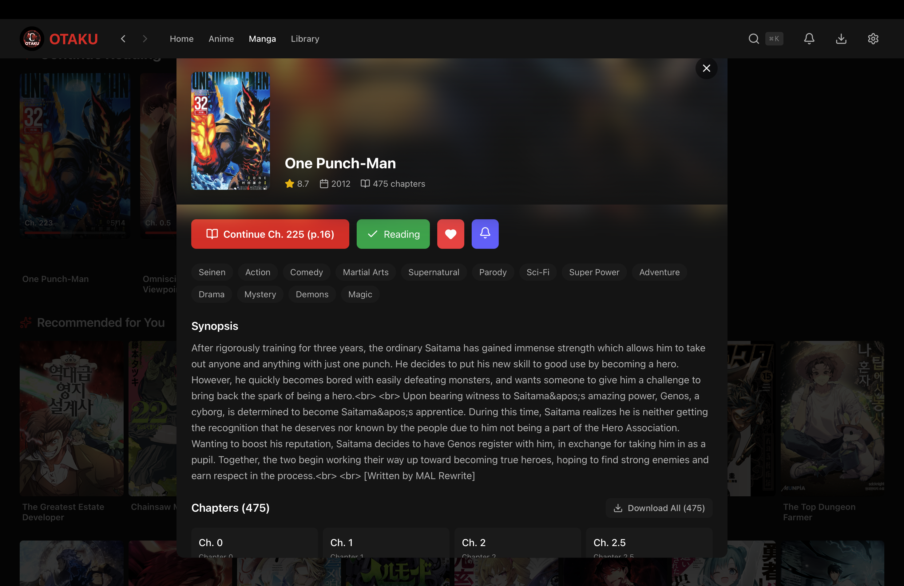
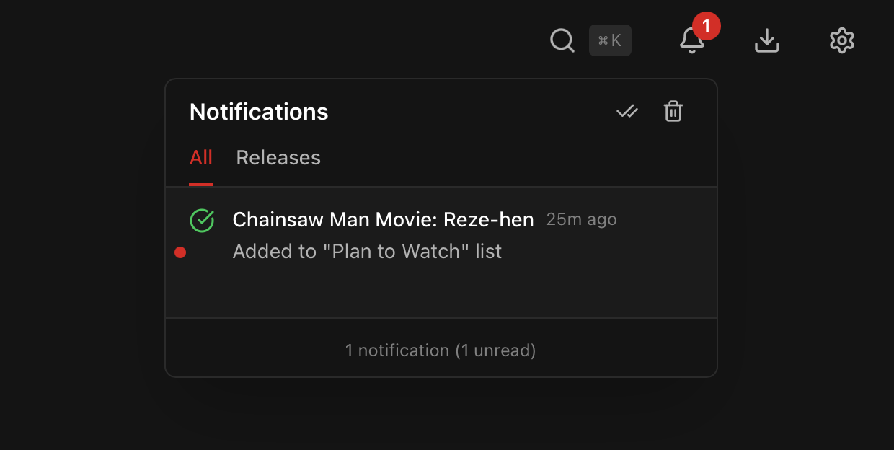

<p align="center">
  
</p>

<h1 align="center">おたく</h1>
<p align="center"><b>Otaku</b> — Anime & Manga Streaming Platform</p>

<p align="center">
  <a href="https://github.com/vishnukv64/otaku/releases/latest"></a>
  <a href="https://github.com/vishnukv64/otaku/releases"></a>
  <a href="https://github.com/vishnukv64/otaku/blob/main/LICENSE"></a>
</p>

A cross-platform desktop application for streaming anime and reading manga, built with Tauri, React, and Rust. Otaku provides a modern, Netflix-inspired interface for discovering, watching, reading, and organizing your anime and manga collection.

---

## Highlights

- **Stream Anime** — Watch from multiple sources with HLS adaptive streaming and quality selection
- **Read Manga** — Full-featured manga reader with multiple reading modes and offline support
- **Unified Library** — Manage both anime and manga in one place with status tracking
- **Release Notifications** — Get notified when new episodes or chapters are released
- **Offline Support** — Download episodes and chapters for offline viewing/reading
- **Cross-Platform** — Available for Windows, macOS, and Linux

---

## Table of Contents

- [Features](#features)
- [Screenshots](#screenshots)
- [System Requirements](#system-requirements)
- [Installation](#installation)
  - [Download Pre-built Binaries](#download-pre-built-binaries)
  - [Windows Installation](#windows-installation)
  - [macOS Installation](#macos-installation)
  - [Linux Installation](#linux-installation)
- [Building from Source](#building-from-source)
- [Usage Guide](#usage-guide)
- [Keyboard Shortcuts](#keyboard-shortcuts)
- [Configuration](#configuration)
- [Extension System](#extension-system)
- [Troubleshooting](#troubleshooting)
- [Contributing](#contributing)
- [Tech Stack](#tech-stack)
- [Project Structure](#project-structure)
- [License](#license)
- [Disclaimer](#disclaimer)

---

## Features

### Anime Streaming

- Stream anime from multiple sources with adaptive bitrate streaming
- Full HLS (HTTP Live Streaming) support with automatic quality adjustment
- Manual quality selection: 1080p, 720p, 480p, 360p
- Multiple server options for each episode with easy switching
- Seamless episode navigation with next/previous controls
- Automatic progress saving with resume functionality
- Native fullscreen support with smooth transitions
- Download episodes for offline viewing

### Manga Reading

- Full-featured manga reader with smooth page navigation
- Multiple reading modes:
  - **Single Page** — One page at a time
  - **Double Page** — Two pages side by side (manga spread view)
  - **Vertical Scroll** — Continuous scrolling (webtoon style)
- Chapter navigation with progress tracking
- Reading progress auto-save with resume support
- Download chapters for offline reading
- Support for both traditional manga and webtoons

### Library Management

- Unified library for both anime and manga
- Status tracking: Watching/Reading, Completed, Plan to Watch/Read, On Hold, Dropped
- Favorites system for quick access to preferred titles
- Watch/read history tracking across all episodes and chapters
- Continue watching and continue reading sections on home page
- Filter and sort library by media type, status, or favorites

### Notification Center

- Centralized notification management with bell icon in navigation
- **Release Alerts** — Get notified when new episodes/chapters release
  - Automatic background checks (configurable: 6h, 12h, 24h, 48h intervals)
  - Manual "Check Now" button for instant checking
  - Tracks ongoing series in your library and favorites
- **Tabbed Interface** — Separate "All" and "Releases" tabs
- Download completion and progress notifications
- Mark as read, dismiss, and clear all functionality
- Notification persistence across app restarts

### Discovery and Search

- Real-time search with instant results as you type
- Browse anime and manga separately with dedicated pages
- **Current Season Tab** — Dedicated view for seasonal anime (e.g., Winter 2026)
  - Full listing sorted by rating
  - Infinite scroll pagination
- **Enhanced Home Page** categories:
  - **Hot Today** — Daily trending anime
  - **New Episodes** — Recently updated anime with new releases
  - **All-Time Classics** — Top-rated anime sorted by score
- **Last Aired Date** display on media cards for airing anime
- Dynamic genre filtering with count indicators
- Browse over 100 genres and tags fetched from sources
- Multi-genre filtering support for refined searches
- Related anime/manga suggestions on detail pages

### Download Manager

- Download episodes and chapters for offline access
- Batch download support for entire series or selected items
- Real-time download progress tracking
- Pause, resume, and cancel functionality
- Automatic file organization by series
- Storage usage monitoring
- Downloaded content available without internet connection

### User Interface

- Dark theme optimized for extended viewing sessions
- Responsive design adapting to various window sizes
- Three grid density options: Compact, Comfortable, Spacious
- Modal-based detail views without navigation interruption
- Smooth animations and transitions throughout
- Keyboard-first navigation support
- NSFW content filtering

### Technical Highlights

- Cross-platform support for Windows, macOS, and Linux
- Native performance with Rust backend
- Low memory footprint compared to Electron alternatives
- SQLite database for local data persistence
- Modular extension system for content sources
- Secure sandboxed JavaScript execution for extensions
- Automatic app updates with changelog notifications

---

## Screenshots

### Home Screen


*The main home screen displaying continue watching, continue reading, trending anime, and personalized recommendations.*

### Anime Browser


*The anime browser page with search functionality and genre-based filtering.*

### Manga Browser


*Browse manga with search, genres, and filtering options.*

### Anime Details Modal


*Detailed anime information showing synopsis, metadata, episode list, and related anime.*

### Manga Details Modal



*Manga detail view with chapter list, download options, and reading progress indicators.*

### Video Player


*Full-featured video player with custom controls, quality selection, and server switching.*

### Manga Reader


*Clean manga reader with multiple reading modes and chapter navigation.*

### Library View


*Personal library with anime and manga organized by status categories.*

### Notification Center



*Notification center with release alerts and download notifications.*

### Download Manager


*Download manager showing anime episodes and manga chapters with progress tracking.*

### Settings Page


*Application settings including appearance, playback, reader preferences, and storage management.*

---

## System Requirements

### Minimum Requirements

| Component | Windows | macOS | Linux |
|-----------|---------|-------|-------|
| Operating System | Windows 10 version 1803+ | macOS 10.15 Catalina+ | Ubuntu 20.04, Fedora 33+ |
| Processor | 64-bit Intel or AMD | Intel or Apple Silicon | 64-bit Intel, AMD, or ARM |
| Memory | 4 GB RAM | 4 GB RAM | 4 GB RAM |
| Storage | 200 MB for application | 200 MB for application | 200 MB for application |
| Display | 1280 x 720 minimum | 1280 x 720 minimum | 1280 x 720 minimum |
| Network | Broadband connection | Broadband connection | Broadband connection |

### Recommended Requirements

| Component | Specification |
|-----------|---------------|
| Memory | 8 GB RAM or more |
| Storage | SSD with 20 GB+ free space for downloads |
| Display | 1920 x 1080 or higher resolution |
| Network | 25 Mbps or faster for HD streaming |

### Platform-Specific Requirements

**Windows:**
- Microsoft Edge WebView2 Runtime (automatically installed if not present)
- Visual C++ Redistributable (included with installer)

**macOS:**
- No additional runtime dependencies required
- Rosetta 2 for Apple Silicon when running Intel builds (automatic)

**Linux:**
- WebKitGTK 4.1
- libappindicator3 or libayatana-appindicator3
- GStreamer with appropriate codecs for media playback

---

## Installation

### Download Pre-built Binaries

Pre-built installers and packages are available for all supported platforms on the GitHub Releases page.

**Latest Release:** [https://github.com/vishnukv64/otaku/releases/latest](https://github.com/vishnukv64/otaku/releases/latest)

**All Releases:** [https://github.com/vishnukv64/otaku/releases](https://github.com/vishnukv64/otaku/releases)

### Available Downloads

| Platform | Architecture | Filename | Description |
|----------|--------------|----------|-------------|
| Windows | x64 (Intel/AMD) | `otaku_VERSION_x64-setup.exe` | NSIS installer with automatic WebView2 installation |
| Windows | x64 (Intel/AMD) | `otaku_VERSION_x64_en-US.msi` | MSI package for enterprise deployment |
| macOS | ARM64 (Apple Silicon) | `otaku_VERSION_aarch64.dmg` | Disk image for M1, M2, M3 Macs |
| macOS | x64 (Intel) | `otaku_VERSION_x64.dmg` | Disk image for Intel-based Macs |
| Linux | x64 (Intel/AMD) | `otaku_VERSION_amd64.deb` | Debian package for Ubuntu, Debian, and derivatives |
| Linux | x64 (Intel/AMD) | `otaku_VERSION_amd64.rpm` | RPM package for Fedora, RHEL, and derivatives |
| Linux | x64 (Intel/AMD) | `otaku_VERSION_amd64.AppImage` | Portable AppImage requiring no installation |

Replace `VERSION` with the actual version number (e.g., `0.2.0`).

---

### Windows Installation

#### Method 1: NSIS Installer (Recommended)

1. Download `otaku_VERSION_x64-setup.exe` from the releases page
2. Run the downloaded installer
3. If prompted by Windows SmartScreen, click "More info" then "Run anyway"
4. Follow the installation wizard
5. Launch Otaku from the Start Menu or desktop shortcut

The installer will automatically download and install Microsoft Edge WebView2 Runtime if not present.

#### Method 2: MSI Package

**Silent Installation (Command Line):**
```powershell
msiexec /i otaku_VERSION_x64_en-US.msi /quiet
```

---

### macOS Installation

#### Determining Your Mac's Architecture

1. Click the Apple menu → "About This Mac"
2. Look for "Chip" or "Processor":
   - "Apple M1/M2/M3" → Download `aarch64.dmg`
   - "Intel Core" → Download `x64.dmg`

#### Installation

1. Download the appropriate DMG file
2. Double-click to mount, drag Otaku to Applications
3. On first launch, if blocked by Gatekeeper, run:
   ```bash
   xattr -cr /Applications/otaku.app
   ```

---

### Linux Installation

#### Debian/Ubuntu

```bash
sudo apt install ./otaku_VERSION_amd64.deb
```

#### Fedora

```bash
sudo dnf install ./otaku_VERSION_amd64.rpm
```

#### AppImage (Universal)

```bash
chmod +x otaku_VERSION_amd64.AppImage
./otaku_VERSION_amd64.AppImage
```

---

## Building from Source

### Prerequisites

| Tool | Minimum Version | Purpose |
|------|-----------------|---------|
| Node.js | 18.0 | JavaScript runtime |
| pnpm | 8.0 | Package manager |
| Rust | 1.70 | Backend compilation |
| Git | 2.0 | Source code management |

### Platform-Specific Dependencies

**Ubuntu/Debian:**
```bash
sudo apt install -y build-essential libssl-dev libwebkit2gtk-4.1-dev \
  libayatana-appindicator3-dev librsvg2-dev patchelf
```

**Fedora:**
```bash
sudo dnf groupinstall "Development Tools"
sudo dnf install openssl-devel webkit2gtk4.1-devel libappindicator-gtk3-devel librsvg2-devel
```

**macOS:**
```bash
xcode-select --install
```

### Building

```bash
# Clone the repository
git clone https://github.com/vishnukv64/otaku.git
cd otaku

# Install dependencies
pnpm install

# Run in development mode
pnpm tauri dev

# Build for production
pnpm tauri build
```

---

## Usage Guide

### Browsing and Searching

1. Click **Anime** or **Manga** in the navigation bar
2. Use the search bar to find specific titles
3. Click genre tags to filter content
4. Select multiple genres for combined filtering

### Watching Anime

1. Click on any anime card to open details
2. Click "Watch Now" or select a specific episode
3. In the video player:
   - Use quality/server buttons to change source
   - Press **N**/**P** for next/previous episode
   - Progress auto-saves for resuming later

### Reading Manga

1. Click on any manga card to open details
2. Click "Read Now" or select a specific chapter
3. In the manga reader:
   - Use arrow keys or click to navigate pages
   - Press **M** to change reading mode
   - Progress auto-saves for resuming later

### Managing Your Library

1. Navigate to **Library** in the navigation bar
2. Toggle between Anime and Manga tabs
3. Filter by status: Watching, Completed, Plan to Watch, etc.
4. Add items from their detail modals
5. Right-click items to change status

### Release Notifications

1. Click the **bell icon** in the navigation bar
2. Switch to **Releases** tab for new episode/chapter alerts
3. Configure auto-check interval via the settings gear
4. Click "Check Now" for immediate checking
5. Click notification actions to jump directly to new content

### Downloading Content

1. Open anime/manga details
2. Click "Download All" or "Select Episodes/Chapters"
3. Monitor progress in the Downloads section
4. Downloaded content shows a green indicator
5. Access offline content anytime without internet

---

## Keyboard Shortcuts

### Global

| Shortcut | Action |
|----------|--------|
| `Cmd/Ctrl + K` | Open spotlight search |
| `/` | Focus search bar |
| `Escape` | Close modal or exit fullscreen |

### Video Player

| Shortcut | Action |
|----------|--------|
| `Space` / `K` | Toggle play/pause |
| `F` | Toggle fullscreen |
| `M` | Toggle mute |
| `←` / `→` | Seek -10s / +10s |
| `↑` / `↓` | Volume +10% / -10% |
| `N` | Next episode |
| `P` | Previous episode |
| `0-9` | Seek to 0%-90% |

### Manga Reader

| Shortcut | Action |
|----------|--------|
| `←` / `→` | Previous / Next page |
| `Space` | Next page |
| `M` | Cycle reading mode |
| `F` | Toggle fullscreen |
| `N` | Next chapter |
| `P` | Previous chapter |
| `Escape` | Exit reader |

---

## Configuration

### Data Storage Locations

**Windows:**
```
%APPDATA%\com.otaku.player\
```

**macOS:**
```
~/Library/Application Support/com.otaku.player/
```

**Linux:**
```
~/.config/com.otaku.player/
~/.local/share/com.otaku.player/
```

### Database

Otaku uses SQLite for local data storage containing:
- Watch and reading history with progress
- Library entries and status
- Media metadata cache
- Download records
- Notification history
- Release tracking data

---

## Extension System

Otaku uses a modular extension system to support multiple content sources.

### Security Model

- Extensions run in a QuickJS sandbox without filesystem access
- Network requests are limited to whitelisted domains
- No access to Node.js or browser APIs
- All communication through a defined interface

### Extension Interface

| Method | Purpose |
|--------|---------|
| `search(query, page)` | Search for anime/manga by title |
| `discover(page, sortType, genres)` | Browse with filters |
| `getDetails(id)` | Get detailed information |
| `getSources(episodeId)` | Get video sources (anime) |
| `getChapterImages(chapterId)` | Get chapter images (manga) |
| `getTags(page)` | Get available genres and tags |

---

## Troubleshooting

### Application Won't Start

**Windows:** Ensure WebView2 Runtime is installed. Reinstall if necessary.

**macOS:** Run `xattr -cr /Applications/otaku.app` to remove quarantine.

**Linux:** Verify dependencies are installed. Run from terminal to see errors.

### Video/Manga Won't Load

1. Check your internet connection
2. Try switching to a different server
3. Try a lower quality setting
4. Wait and retry (server may be temporarily unavailable)

### Downloads Fail

1. Ensure sufficient disk space
2. Check downloads folder is writable
3. Try a different server source

### Reset Application

**Warning:** This deletes all data including library and history.

```bash
# macOS
rm -rf ~/Library/Application\ Support/com.otaku.player

# Linux
rm -rf ~/.config/com.otaku.player ~/.local/share/com.otaku.player

# Windows (PowerShell)
Remove-Item -Recurse -Force "$env:APPDATA\com.otaku.player"
```

### Reporting Bugs

Include: OS version, app version, steps to reproduce, expected vs actual behavior, logs/screenshots.

Submit issues: [https://github.com/vishnukv64/otaku/issues](https://github.com/vishnukv64/otaku/issues)

---

## Tech Stack

### Frontend

| Technology | Purpose |
|------------|---------|
| React 18 | UI framework |
| TypeScript 5 | Type-safe JavaScript |
| Tailwind CSS 4 | Utility-first styling |
| Zustand 5 | State management |
| TanStack Router | Client-side routing |
| Vite 6 | Build tool |
| HLS.js | HTTP Live Streaming |

### Backend

| Technology | Purpose |
|------------|---------|
| Tauri 2 | Desktop application framework |
| Rust | Backend language |
| SQLite | Local database |
| QuickJS | JavaScript sandbox for extensions |
| Tokio | Async runtime |
| Axum | HTTP server for video streaming |
| SQLx | Database toolkit |

---

## Project Structure

```
otaku/
├── src/                        # Frontend source
│   ├── components/
│   │   ├── layout/             # AppShell, TopNav
│   │   ├── media/              # MediaCard, MediaDetailModal, MangaDetailModal
│   │   ├── player/             # VideoPlayer, DownloadManager
│   │   ├── reader/             # MangaReader
│   │   └── notifications/      # NotificationCenter
│   ├── routes/                 # Page components
│   ├── store/                  # Zustand stores
│   ├── hooks/                  # Custom React hooks
│   └── utils/                  # Utilities, Tauri commands
├── src-tauri/                  # Backend source
│   ├── src/
│   │   ├── commands.rs         # Tauri command handlers
│   │   ├── extensions/         # Extension system
│   │   ├── database/           # SQLite operations
│   │   ├── downloads/          # Download manager
│   │   ├── notifications.rs    # Notification system
│   │   ├── release_checker.rs  # Release tracking
│   │   └── video_server.rs     # Local video server
│   ├── migrations/             # Database migrations
│   └── extensions/             # Bundled extensions
└── docs/                       # GitHub Pages landing page
    ├── index.html              # Landing page
    ├── styles.css              # Styling
    ├── script.js               # OS detection and downloads
    └── screenshots/            # Application screenshots
```

---

## License

This project is licensed under the MIT License. See [LICENSE](LICENSE) for details.

---

## Disclaimer

This application is intended for educational and personal use only. The developers do not host, store, or distribute any copyrighted content. All media content is retrieved from third-party sources through user-installed extensions. Users are solely responsible for ensuring they have the legal right to access content in their jurisdiction.

By using this application, you agree to comply with all applicable laws and regulations regarding digital media consumption.

---

## Acknowledgments

- [Tauri](https://tauri.app/) — Cross-platform desktop framework
- [React](https://react.dev/) — UI library
- [Rust](https://www.rust-lang.org/) — Backend language
- [Tailwind CSS](https://tailwindcss.com/) — CSS framework
- [HLS.js](https://github.com/video-dev/hls.js/) — HLS playback
- [QuickJS](https://bellard.org/quickjs/) — JavaScript sandbox

Special thanks to the open-source community for their continuous contributions.
